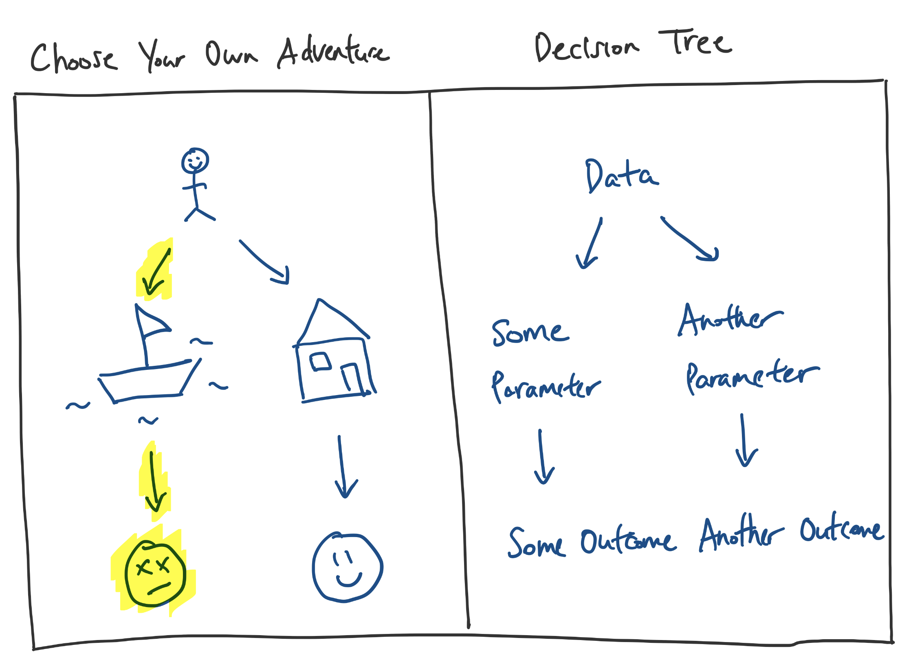
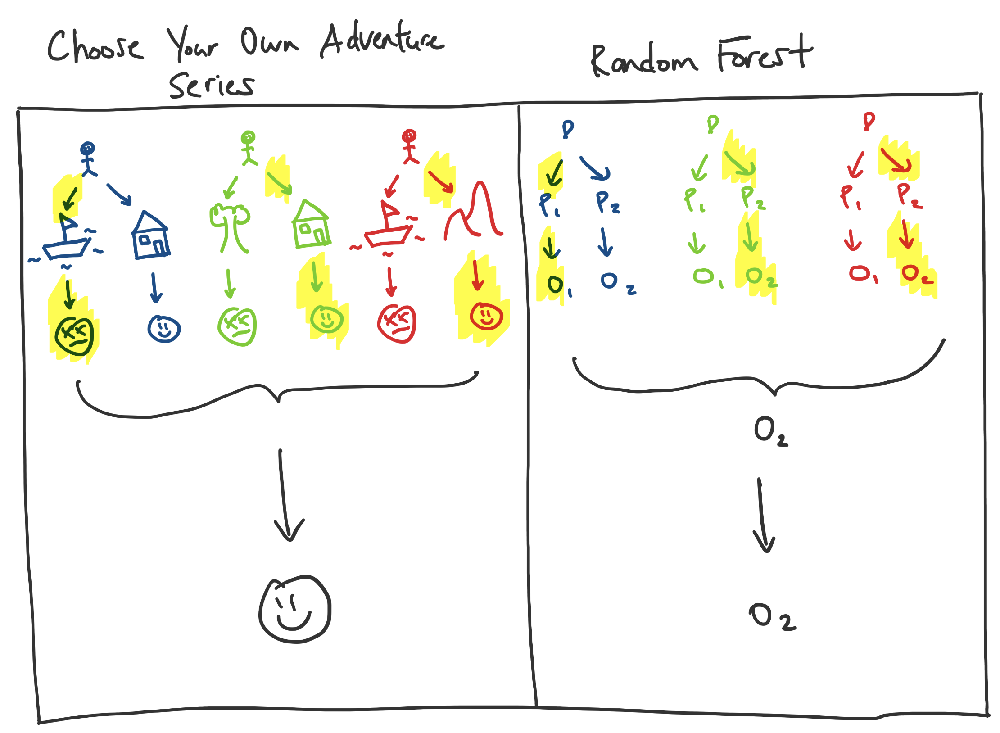
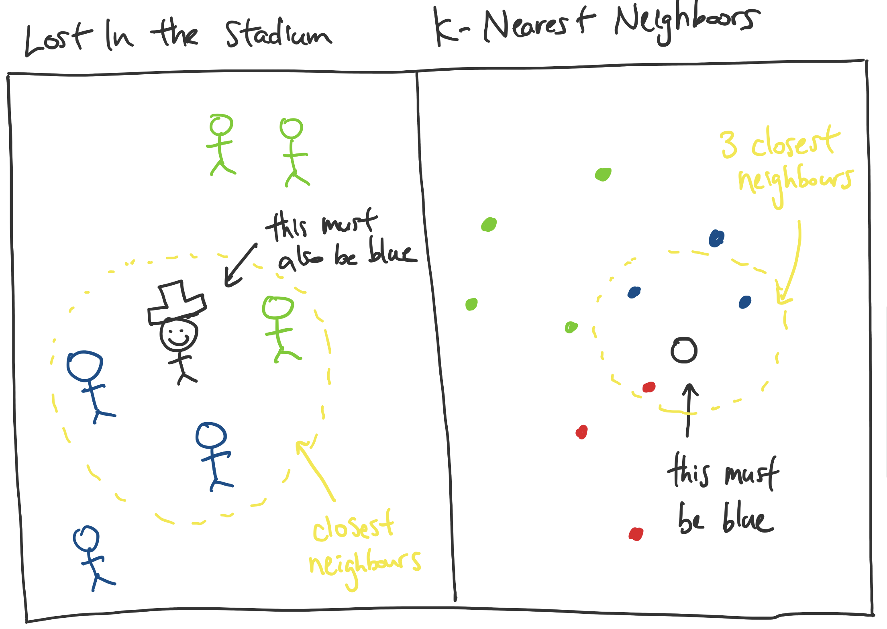

## Three Everyday Analogies to Machine Learning Models

As data science makes its way out of academia into industry, there is an increasing number of roles that interact with data scientists on a daily basis. While those working on the periphery of data science may not directly build the machine learning models, understanding the basics can be immensely helpful. This will enable you to get a better grasp of what you are asking of your data scientist counterparts and what the limitations may be. Here is a quick start guide to just a few commonly used models and problems they solve. 

## **Decision Tree.**

One of my favourite types of books growing up was the “Choose Your Own Adventure” books. Every few pages, you were given a choice to make and that choice would lead you into reading a different part of the book and storyline. Eventually, you would make it to your very own unique ending. 

This is analogous to how a Decision Tree model works. The trained model is similar to your book above. There’s a predetermined number of choices, or “decision splits”  and based on that, a unique outcome. When data scientists train the model, they are essentially using the data they have to formulate the storyline and where it makes sense for the splits to occur. Once this is established, we can feed in a new data point. This new data point acts like a new reader. It follows the path of the storyline and makes its way toward the outcome. This outcome is our prediction. 

This type of modelling is useful because we can trace back exactly the steps that got us to our endpoint. A real life example may be understanding if an order will result in a refund. Following the example below, if we can predict from the Decision Tree that the order will result in a refund, we can trace back the immediate last step that got us to the end outcome and see if we can make any changes there. One of the drawbacks of this model is that it’s very rigid. Your customer would have had to follow the exact decisions in your decision tree to arrive at the outcome. More on this later. 

## **Random Forest.**

Let’s say you get to the end of your “Choose Your Own Adventure” book and your character has died. What do you do? Naturally, you can read another book of this nature and arrive at a different ending. Say you’ve read three of these books and in two of the endings, your character has survived. We can then conclude that generally speaking, you live. 

The model above is known as the Random Forest model. It simply takes several decision trees and averages out the most likely outcome. The idea behind this model is that by taking several decision trees, each with different decision splits, we incorporate more variation into our model and therefore arrive at more accurate outcomes. This makes sense. If you were just unlucky in your choices in one book, you still have a chance of survival if over the course of many books you happen to live.

Random Forest models can solve similar problems that Decision Trees solve. The averaging process at the end makes them not as directly interpretable as Decision Tree models, but they are significantly more flexible. Relying on several different trees instead of just one means that we are more likely to converge to the correct prediction. When we have a large dataset, with many possible outcomes to consider, this is usually a better tool than Decision Trees.

## **K-Nearest Neighbours.**

Suppose you’re lost in a big crowd of people at a sports game. You’re desperately trying to make it back to your seat before halftime. The only form of navigation you have is identifying the jerseys of the people closest to you. If more people around you are wearing jerseys of your team than the other team, you can assume you’re in the area where your team is. If the opposite is true, you can assume you’re still in the other team’s area.

This type of model in machine learning is known as K-Nearest Neighbours (KNNs).  The trained model is the stadium with all the fans in their jerseys. When we get a new data point, we look at who the closest neighbours are. Whichever neighbour occurs most frequently is what we predict the new data point to be. We can try different models by tweaking how many closest neighbours we consider. In the diagram below, we are only considering three neighbours.

KNNs are useful when we are interested in categorizing data based on similar traits. For instance, it can allow us to predict if a new customer is likely to initiate a refund based on if that customer’s profile is more similar to other customers who have processed a refund or not.

The models described above are just a few of the models data scientists use everyday. While there is much more detail than what was covered, the general intuition of most models is not so different from everyday problems we encounter. Hopefully, this quick start guide has helped demystify the inner workings of these basic models.  

_________

